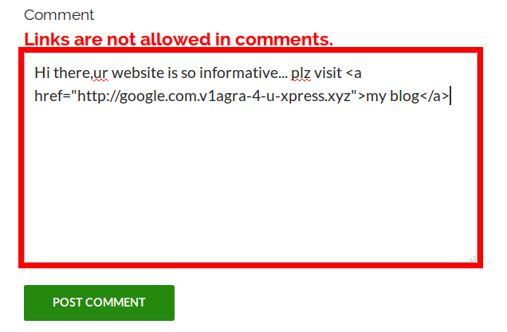
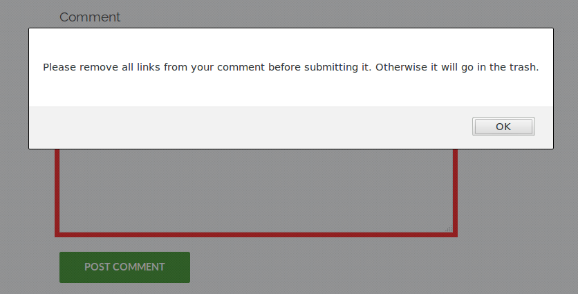

# Stop Comment Links

This is alpha software. Use at your own risk.

See the readme.txt file for more information.

## Screenshots

When links are added, a warning message is shown:

If the user tries to submit the comment in that state, it will block the submission:

The user can override this behavior with a little bit of work, in which case you can moderate the comment in the WP dashboard.
